# AetherFlow ⚡

  <strong>Ultra-Lightweight, High-Performance Windows Desktop Live Wallpaper Engine</strong>

  
  
  
  
  

---

  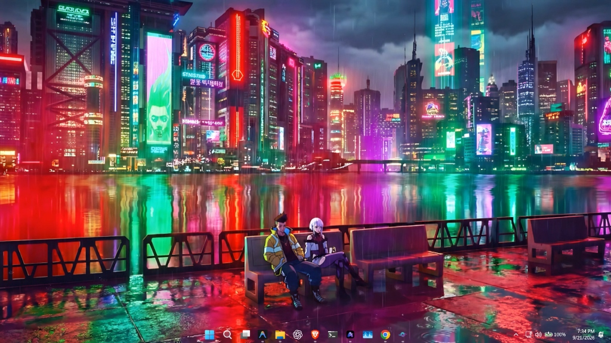

  <a href="https://aetherflow-official.github.io/aetherflow/"><strong>🌐 Official Website</strong></a> •
  <a href="https://aetherflow-official.github.io/aetherflow/manual.html"><strong>📖 User Operating Manual</strong></a> •
  <a href="https://buymeacoffee.com/yashpreet"><strong>☕ Buy Me a Coffee</strong></a> •
  <a href="https://www.patreon.com/cw/AetherFlow_official"><strong>💖 Patreon</strong></a> •
  <a href="https://aetherflow-official.github.io/aetherflow/privacy.html"><strong>🔒 Privacy Policy</strong></a> •
  <a href="https://aetherflow-official.github.io/aetherflow/license.html"><strong>⚖️ License Terms (EULA)</strong></a> •
  <a href="https://github.com/aetherflow-official/aetherflow/issues"><strong>💬 Issues &amp; Support</strong></a>

---

## 🌟 What is AetherFlow?

**AetherFlow** is a modern, ultra-efficient live wallpaper and desktop personalization engine engineered specifically for Windows 10 and 11. Built with a high-performance native **Tauri 2 & Rust** core paired with a reactive UI, AetherFlow pins animated video loops, live web streams, and procedural simulations directly behind your Windows desktop icons with virtually zero resource footprint.

AetherFlow is distributed as **Proprietary Freeware (Closed-Source)** — 100% free for personal desktop use with no advertisements, no tracking telemetry, and no bloatware.

---

## 📸 Desktop & In-App Showcase

### 1. Live Desktop Player & Real-Time Controls
Adjust opacity, brightness, contrast, saturation, playback speed, and volume in real-time with instant hardware preview.

  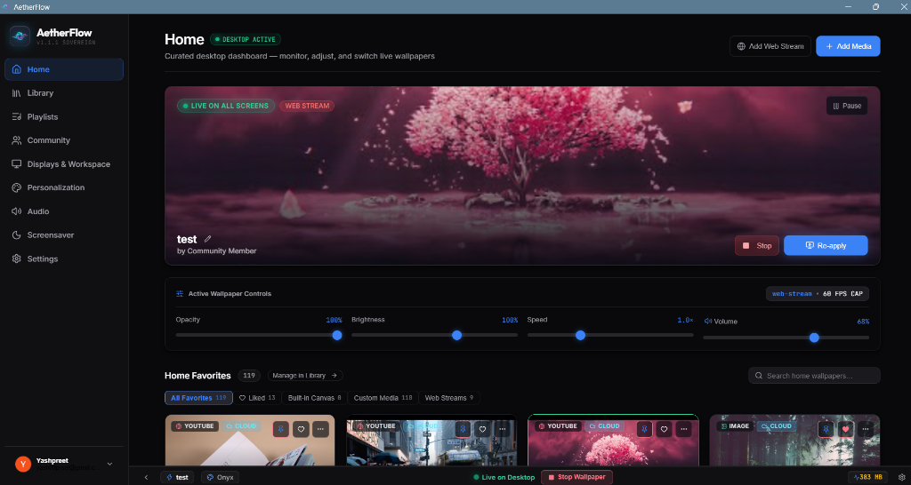

### 2. Wallpaper Library & Offline Cloud Stream
Manage local storage, offline downloads, and cloud streaming saves (~1.5+ GB disk savings) with multi-criteria tag filtering.

  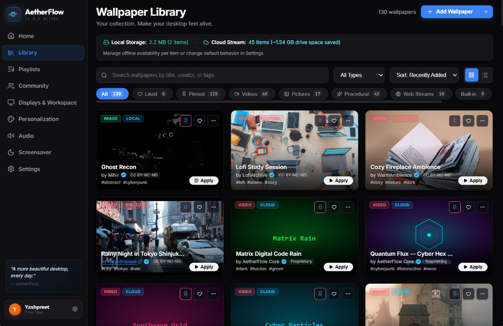

### 3. Wallpaper Playlists & Automated Rotation
Create custom playlists, select multi-monitor target displays, configure rotation intervals (1m to 1h), and smooth transitions (Fade, Slide, Zoom).

  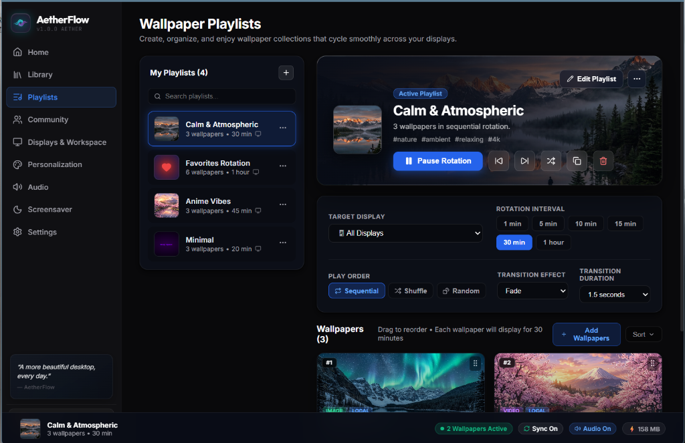

### 4. Real Windows Desktop Captures
Live wallpapers pinned behind native Windows desktop icons with taskbar integration:

| The Batman Cinematic Wallpaper | Cyberpunk GT-R Widebody (Video Engine) |
|:---:|:---:|
| 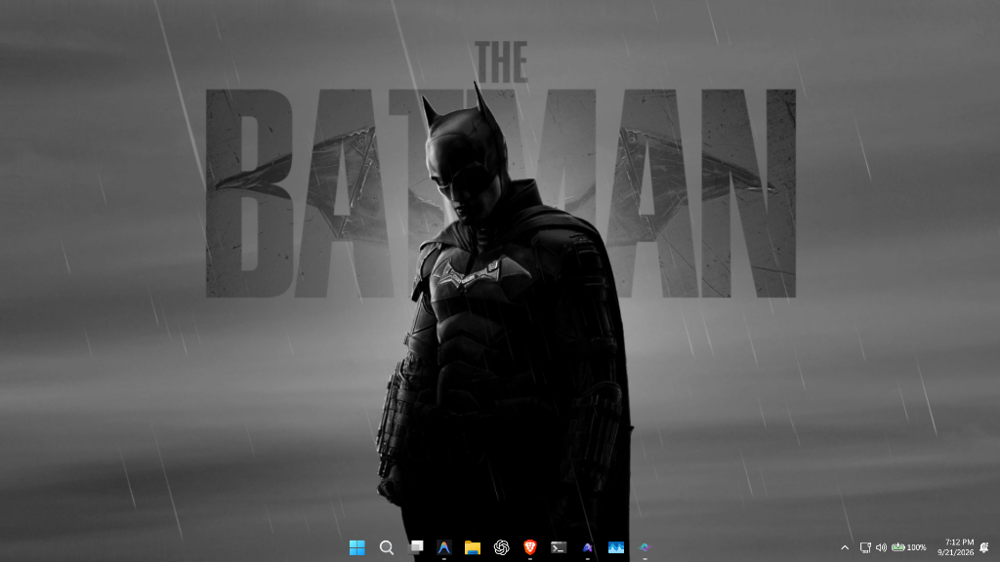 | 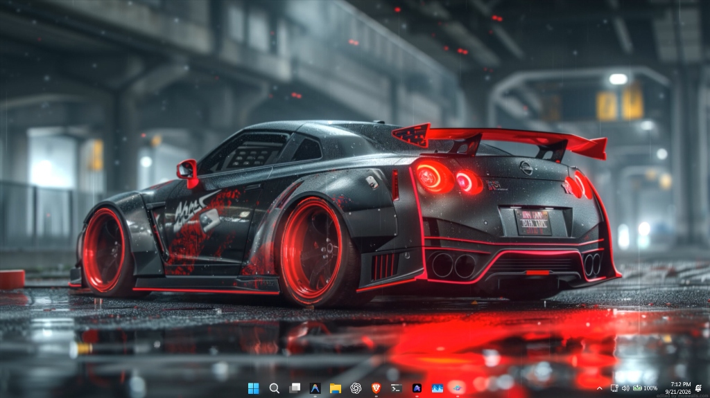 |

| Sakura Drift (Live Stream) | Demon Slayer Snake Hashira |
|:---:|:---:|
| 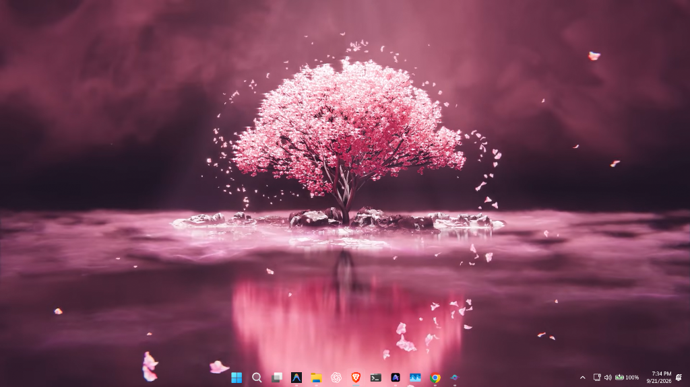 | 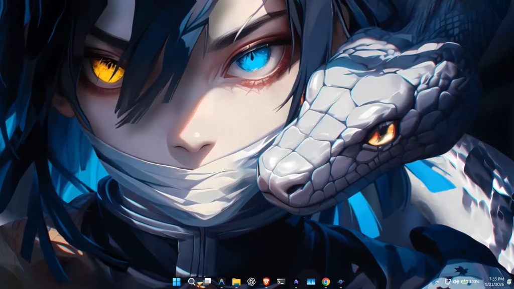 |

### 5. Community Hub Open Catalog
Discover, preview, and download curated wallpapers created worldwide with instant 1-click desktop apply.

  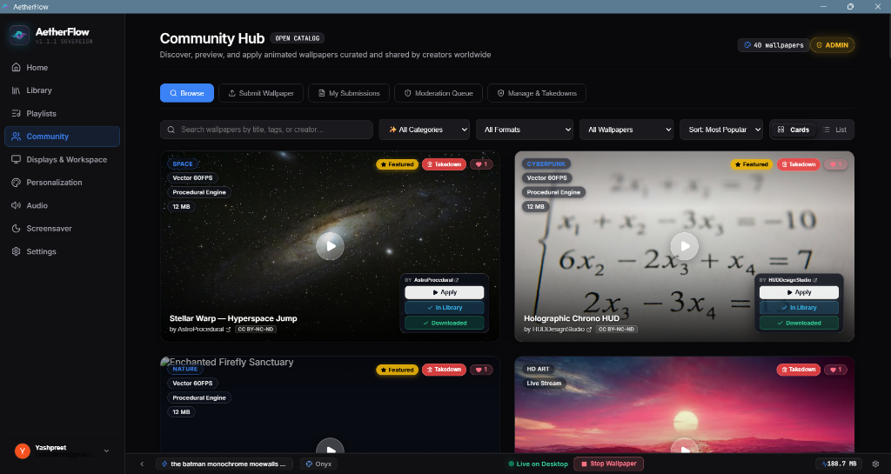

### 6. OLED Screensaver & Live Clock HUD
Integrated OLED burn-in prevention screensaver featuring real-time clock HUD simulation and system idle automation.

  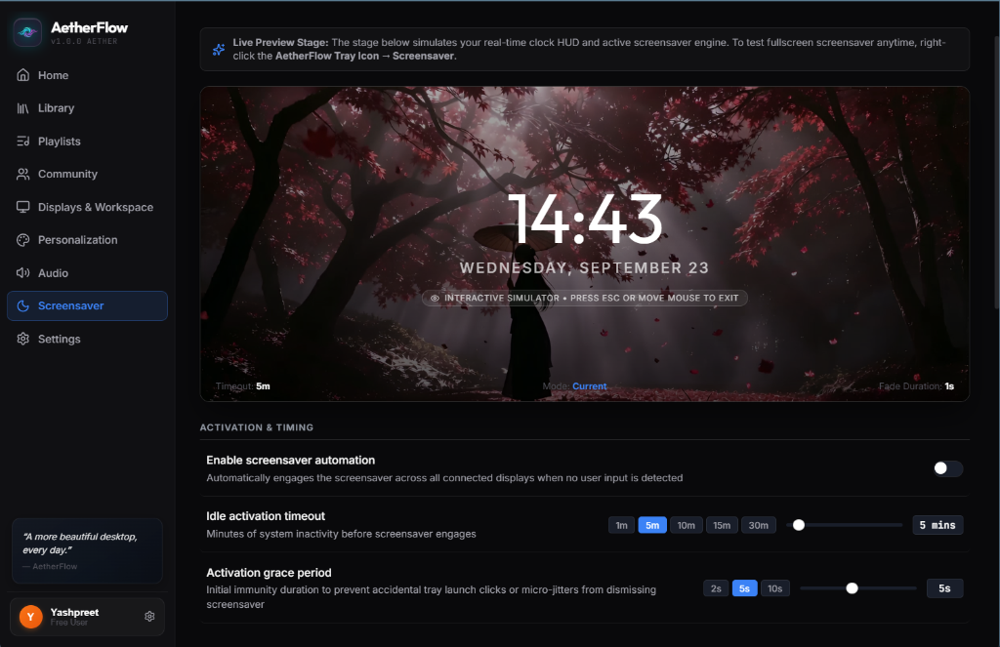

### 7. Live Theme Studio & Taskbar Personalization
8 built-in themes plus a live CSS palette editor with Windows Taskbar transparent, acrylic blur, and color-matched modes.

  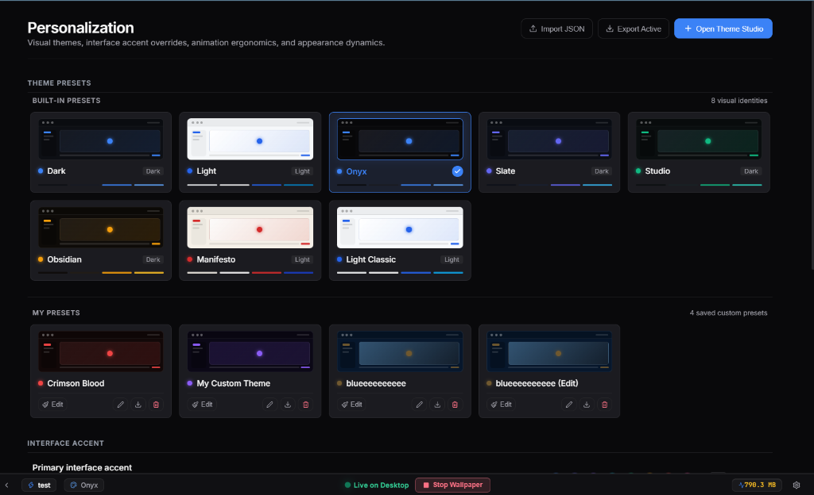

---

## ✨ Core Features

### 🎬 High-Performance Video Engine
- **Hardware-Accelerated Decoding**: Plays 1080p, 4K, and ultra-wide video wallpapers (`.mp4`, `.webm`, `.mkv`, `.mov`).
- **Seamless Looping**: Perfect continuous playback with zero frame stutter.
- **Audio Control**: Independent audio volume and mute controls separate from Windows system volume.

### 🌐 Live Web Streams & YouTube
- Pin any YouTube live stream (e.g. Lofi Girl, Tokyo 24/7 city cameras) or HTML5 stream directly to your desktop.
- Player UI and ads are automatically stripped for a clean, frameless wallpaper presentation.

### 🎨 8 Procedural Canvas 2D Animated Engines
Ultra-lightweight simulations running at steady 60 FPS with minimal CPU usage (~0.5% CPU):
- **Matrix Rain**: Classic green phosphor digital glyphs.
- **Cyber Particles**: Dynamic constellation particle mesh reacting to cursor movement.
- **Synthwave Grid**: Retro 80s neon horizon with undulating wireframe mountains.
- **Deep Space**: Multi-layered starfield parallax and warp drive acceleration.
- **Aurora Borealis**: Flowing luminous curtains of arctic light.
- **Tokyo Neon Rain**: Cyberpunk city street drenched in neon reflections.
- **Quantum Flux**: Vibrant kinetic plasma waves.
- **Audio Spectrum HUD**: Real-time frequency bars reacting to system sound.

### ⚡ Intelligent Hardware Ergonomics
- **Automatic Fullscreen Game Suppression**: Instantly detects when a 3D game, CAD tool, or full-screen app is active and suspends wallpaper rendering, dropping CPU and GPU consumption to **0.0%**.
- **OLED Deep Blackout Screensaver**: Prevents burn-in on OLED displays by activating a true `#000000` blackout mode after a configurable idle timer.
- **Battery Preservation**: Automatically throttles frame rates to 30 FPS when running on laptop battery power.

### 🖥️ Multi-Monitor Geometry & Icon Layering
- **Per-Display or Spanning**: Run independent wallpapers on each screen or span ultra-wide panoramas across multiple monitors.
- **Desktop Icon Integrity**: Attached strictly behind Windows `SHELLDLL_DefView` and `WorkerW`, keeping desktop icons interactive and visible.
- **DWM Margin Compensation**: Eliminates border bleed and white edge lines across mixed-DPI displays.

---

## 📥 Download & Installation

### Option 1: Standalone Executable (Portable)
*No installation wizard required. Zero footprint.*
1. Download **[`AetherFlow.exe`](https://github.com/aetherflow-official/aetherflow/releases/download/v1.0.0/AetherFlow.exe)** (~8.2 MB).
2. Place it in any directory (e.g. `C:\Tools\AetherFlow\`).
3. Double-click to launch.

### Option 2: Signed Windows MSIX Package
*Includes Windows Start Menu integration and Windows Startup support.*
1. Download **[`AetherFlow_1.0.0_x64.msix`](https://github.com/aetherflow-official/aetherflow/releases/download/v1.0.0/AetherFlow_1.0.0_x64.msix)** (~208 MB).
2. Trust the developer certificate:
   - **Quick Method:** Run `install_cert.bat` as Administrator.
   - **Manual Method:** Right-click MSIX → *Properties* → *Digital Signatures* → *Details* → *View Certificate* → *Install Certificate* → *Local Machine* → *Trusted Root Certification Authorities*.
3. Double-click the `.msix` file and click **Install**.

---

## ⚙️ System Requirements

| Specification | Minimum Requirement | Recommended |
|---|---|---|
| **Operating System** | Windows 10 (64-bit) 19041+ | Windows 11 (64-bit) |
| **Processor** | Dual-core 1.6 GHz | Quad-core 2.4 GHz+ |
| **Memory (RAM)** | 2 GB | 4 GB+ |
| **Graphics** | DirectX 11 compatible | DirectX 12 compatible |
| **Storage** | 50 MB free disk space | 250 MB free disk space |
| **Web Runtime** | WebView2 (pre-installed on Win 10/11) | WebView2 Evergreen |

---

## 🔒 Privacy & Security

AetherFlow operates under a strict **Zero-Telemetry Protocol**:
- **No Background Trackers**: No Google Analytics, Mixpanel, or telemetry spyware.
- **Local Storage Only**: Preferences and downloaded wallpapers stay in `%APPDATA%\AetherFlow`.
- **In-Memory Audio**: Audio visualizer computes FFT spectrums transiently in RAM without saving or transmitting audio.
- **Camera Access Disabled**: Chromium video-capture modules are permanently disabled (`--disable-video-capture`) at the engine level.

Read the full [Privacy Policy](https://aetherflow-official.github.io/aetherflow/privacy.html) for complete details.

---

## 💖 Support AetherFlow Development

AetherFlow is 100% free, zero-bloat, and ad-free. It is independently engineered and maintained. If AetherFlow brings your Windows desktop to life, consider supporting continued development, server infrastructure, and new procedural wallpaper engines:

  
  &nbsp;&nbsp;
  

* **[Buy Me a Coffee](https://buymeacoffee.com/yashpreet)**: Perfect for one-time tips ($3 or $5) to fuel late-night coding sessions.
* **[Patreon Backer](https://www.patreon.com/cw/AetherFlow_official)**: Monthly backing with beta access, engine voting, exclusive wallpaper packs, and backer credits.

---

## 📄 License & Terms

AetherFlow is provided as **Proprietary Freeware (Closed-Source)**.  
Copyright © 2026 Yashpreet. All Rights Reserved.

- **Personal Use:** Free of charge for personal desktop customization.
- **Restrictions:** Reverse engineering, decompilation, resale, bundling, and unauthorized redistribution of modified binaries are strictly prohibited.
- **Community Art:** Artwork submitted to the Community Hub remains under copyright of respective creators.

See the complete [End User License Agreement (EULA)](https://aetherflow-official.github.io/aetherflow/license.html) for legal terms.

---

  Crafted by <strong>Yashpreet</strong> • Powered by <strong>Tauri 2</strong> and <strong>Rust</strong>

